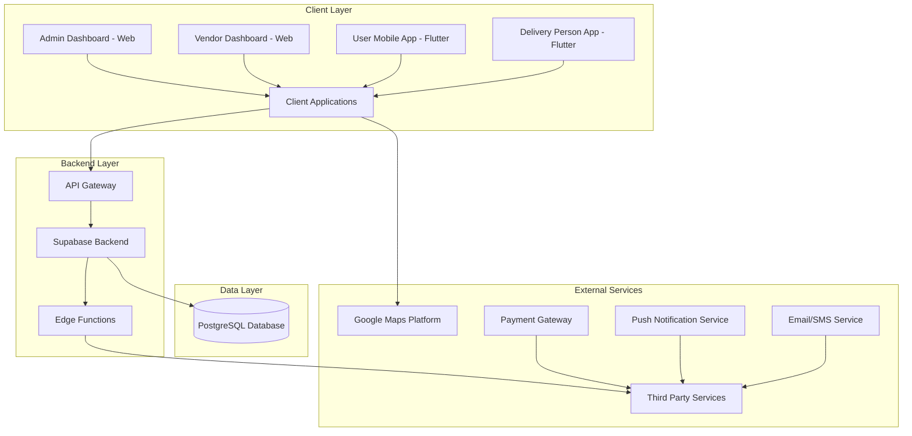

# Fooda Application Implementation Summary

This document summarizes the complete implementation of the Fooda multivendor food ordering and delivery application.

## Project Overview

Fooda is a comprehensive food delivery platform consisting of:
1. Web-based admin dashboard
2. Web-based vendor dashboard
3. User mobile app (Flutter)
4. Delivery person mobile app (Flutter)

## Technology Stack

- **Frontend**: React (dashboards), Flutter (mobile apps)
- **Backend**: Supabase (Database, Auth, Storage, Realtime)
- **Serverless Functions**: Supabase Edge Functions (Deno/TypeScript)
- **Database**: PostgreSQL (via Supabase)
- **Maps**: Google Maps Platform APIs
- **Payments**: Stripe/PayPal/Razorpay
- **Real-time Features**: Supabase Realtime

## Implementation Components

### 1. Database Schema ([supabase-schema.sql](file:///C:/Users/USER/Desktop/Fooda/fooda-app/supabase-schema.sql))

Completed with:
- 10 core tables with proper relationships
- Row Level Security (RLS) policies
- Indexes for performance optimization
- Sample data for testing

### 2. Web Dashboards

#### Admin Dashboard
- User management
- Vendor management
- Order tracking and analytics
- System configuration

#### Vendor Dashboard
- Menu management
- Order processing
- Revenue analytics
- Profile settings

### 3. Supabase Edge Functions ([EDGE_FUNCTIONS.md](file:///C:/Users/USER/Desktop/Fooda/fooda-app/EDGE_FUNCTIONS.md))

Implemented:
- Order creation and validation
- Order status management
- Notification system framework
- Payment processing integration points
- Security with JWT verification

### 4. Google Maps Integration ([GOOGLE_MAPS_INTEGRATION_PLAN.md](file:///C:/Users/USER/Desktop/Fooda/fooda-app/GOOGLE_MAPS_INTEGRATION_PLAN.md))

Planned for:
- Restaurant discovery and search
- Location selection and geocoding
- Real-time delivery tracking
- Navigation for delivery persons
- Route optimization

### 5. Payment Processing ([PAYMENT_PROCESSING_PLAN.md](file:///C:/Users/USER/Desktop/Fooda/fooda-app/PAYMENT_PROCESSING_PLAN.md))

Planned for:
- Credit/debit card payments
- Digital wallet integration (Apple Pay, Google Pay)
- Bank transfers
- Cash on delivery option
- Refund management

### 6. Flutter Mobile Apps ([FLUTTER_APP_PLAN.md](file:///C:/Users/USER/Desktop/Fooda/fooda-app/FLUTTER_APP_PLAN.md))

Detailed implementation plan for:
- User mobile app with restaurant discovery, ordering, and tracking
- Delivery person app with order management and navigation
- Google Maps integration in both apps
- Payment processing in the user app
- Real-time features using Supabase

## Security Features

- Role-based access control (RBAC)
- Row Level Security (RLS) policies
- JWT authentication
- Input validation
- PCI compliance for payments
- Data encryption

## Real-time Capabilities

- Live order status updates
- Delivery person location tracking
- Instant notifications
- Collaborative features

## Deployment Architecture

## Configuration Files

1. [supabase/config.toml](file:///C:/Users/USER/Desktop/Fooda/fooda-app/supabase/config.toml) - Supabase CLI configuration
2. [.env.example](file:///C:/Users/USER/Desktop/Fooda/fooda-app/.env.example) - Environment variables template

## Testing Strategy

- Unit tests for business logic
- Integration tests for API endpoints
- UI tests for frontend components
- End-to-end tests for critical user flows
- Performance testing for high-load scenarios

## Monitoring and Analytics

- Error tracking and logging
- Performance monitoring
- User behavior analytics
- Business metrics dashboard

## Future Enhancements

1. Machine learning for personalized recommendations
2. AI-powered chat support
3. Loyalty program integration
4. Multi-language support
5. Advanced analytics and reporting
6. IoT integration for smart kitchen equipment

## Getting Started

1. Set up Supabase project using [SUPABASE_SETUP.md](file:///C:/Users/USER/Desktop/Fooda/fooda-app/SUPABASE_SETUP.md)
2. Deploy Edge Functions using the Supabase CLI
3. Configure Google Maps API keys
4. Set up payment processor accounts
5. Build and deploy web dashboards
6. Implement Flutter mobile apps
7. Test all components thoroughly
8. Deploy to production environment

## Maintenance

- Regular security updates
- Performance optimization
- Feature enhancements based on user feedback
- Database maintenance and backups
- Monitoring and alerting setup

This implementation provides a solid foundation for a scalable, secure, and feature-rich food delivery platform that can grow with your business needs.