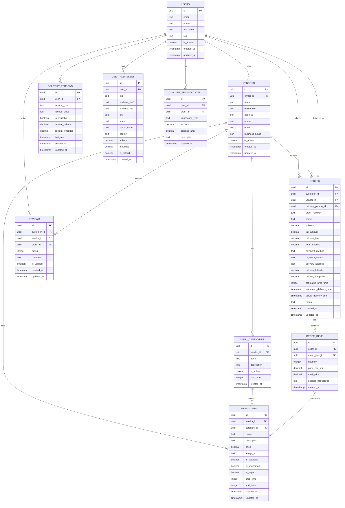

# Database Relationships

```mermaid
erDiagram
    USERS ||--o{ VENDORS : owns
    USERS ||--o{ ORDERS : places
    USERS ||--o{ DELIVERY_PERSONS : is
    USERS ||--o{ USER_ADDRESSES : has
    USERS ||--o{ REVIEWS : writes
    USERS ||--o{ WALLET_TRANSACTIONS : has
    
    VENDORS ||--o{ MENU_CATEGORIES : has
    VENDORS ||--o{ MENU_ITEMS : sells
    VENDORS ||--o{ ORDERS : receives
    VENDORS ||--o{ REVIEWS : receives
    
    MENU_CATEGORIES ||--o{ MENU_ITEMS : contains
    
    ORDERS ||--o{ ORDER_ITEMS : contains
    ORDERS ||--|| USERS : "delivered by"
    
    ORDER_ITEMS }|--|| MENU_ITEMS : references
    
    %% Attributes
    USERS {
        uuid id PK
        text email
        text phone
        text full_name
        text role
        boolean is_active
        timestamp created_at
        timestamp updated_at
    }
    
    VENDORS {
        uuid id PK
        uuid owner_id FK
        text name
        text description
        json address
        text phone
        text email
        json business_hours
        boolean is_active
        timestamp created_at
        timestamp updated_at
    }
    
    MENU_CATEGORIES {
        uuid id PK
        uuid vendor_id FK
        text name
        text description
        boolean is_active
        integer sort_order
        timestamp created_at
    }
    
    MENU_ITEMS {
        uuid id PK
        uuid vendor_id FK
        uuid category_id FK
        text name
        text description
        decimal price
        text image_url
        boolean is_available
        boolean is_vegetarian
        boolean is_vegan
        integer prep_time
        integer sort_order
        timestamp created_at
        timestamp updated_at
    }
    
    USER_ADDRESSES {
        uuid id PK
        uuid user_id FK
        text title
        text address_line1
        text address_line2
        text city
        text state
        text postal_code
        text country
        decimal latitude
        decimal longitude
        boolean is_default
        timestamp created_at
    }
    
    ORDERS {
        uuid id PK
        uuid customer_id FK
        uuid vendor_id FK
        uuid delivery_person_id FK
        text order_number
        text status
        decimal subtotal
        decimal tax_amount
        decimal delivery_fee
        decimal total_amount
        text payment_method
        text payment_status
        json delivery_address
        decimal delivery_latitude
        decimal delivery_longitude
        integer estimated_prep_time
        timestamp estimated_delivery_time
        timestamp actual_delivery_time
        text notes
        timestamp created_at
        timestamp updated_at
    }
    
    ORDER_ITEMS {
        uuid id PK
        uuid order_id FK
        uuid menu_item_id FK
        integer quantity
        decimal price_per_unit
        decimal total_price
        text special_instructions
        timestamp created_at
    }
    
    DELIVERY_PERSONS {
        uuid id PK
        uuid user_id FK
        text vehicle_type
        text license_plate
        boolean is_available
        decimal current_latitude
        decimal current_longitude
        timestamp last_seen
        timestamp created_at
        timestamp updated_at
    }
    
    REVIEWS {
        uuid id PK
        uuid customer_id FK
        uuid vendor_id FK
        uuid order_id FK
        integer rating
        text comment
        boolean is_verified
        timestamp created_at
        timestamp updated_at
    }
    
    WALLET_TRANSACTIONS {
        uuid id PK
        uuid user_id FK
        uuid order_id FK
        text transaction_type
        decimal amount
        decimal balance_after
        text description
        timestamp created_at
    }
```